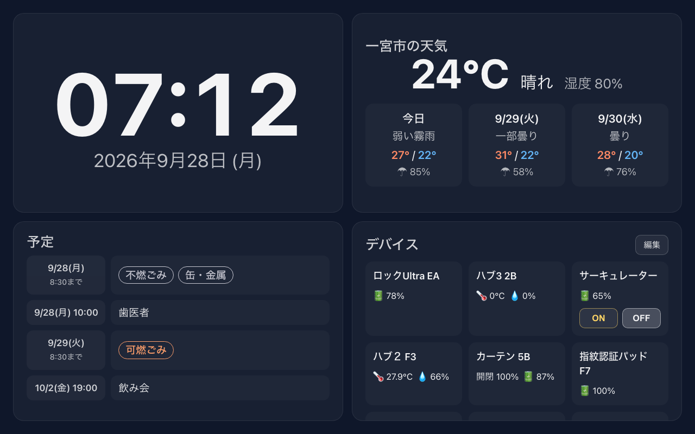

# ホームダッシュボード

SwitchBotデバイスの状態、天気、Appleカレンダーの予定を1画面にまとめて表示する
Webアプリ。Fireタブレット + Fully Kiosk Browser (または Chrome) でのキオスク表示を
想定した、Echo Show 15 / SwitchBotスマートデイリーステーションのようなダッシュボード。



## 構成

```
home-dashboard/
  backend/   Express製のAPIプロキシ。SwitchBot/iCloud/天気への認証情報はここだけに置く
  frontend/  React (Vite) 製のダッシュボードUI。PWA対応
```

本番では `backend` が `frontend/dist` の静的ファイルも配信するため、デプロイ先は
1サービスだけで済みます (CORSやAPIベースURLの設定が不要)。

- 天気: [Open-Meteo](https://open-meteo.com/) — APIキー不要
- SwitchBot: [SwitchBot OpenAPI v1.1](https://github.com/OpenWonderLabs/SwitchBotAPI) — トークン+シークレットでHMAC署名認証
- カレンダー: Apple iCloud カレンダーをCalDAV経由で参照 (アプリ用パスワードを使用)
- ごみ収集日: [一宮市公式サイトの地区別収集日ページ](https://www.city.ichinomiya.aichi.jp/kankyou/shuushuugyoumu/1043991/1043992/index.html)
  から自動取得し、今日 (出す締切まで) と明日の分を予定欄に表示。年度が替わっても新しいページを自動で辿る

## 事前準備 (認証情報の取得)

### SwitchBot トークン・シークレット
1. SwitchBotアプリを開く
2. プロフィール → 設定 → 開発者向けオプション
3. 「トークンを取得」をタップし、表示された `トークン` と `シークレットキー` を控える

### iCloud カレンダー用アプリ専用パスワード
1. https://appleid.apple.com にサインイン
2. 「サインインとセキュリティ」→「App用パスワード」→ 新規作成
3. 発行された `xxxx-xxxx-xxxx-xxxx` 形式のパスワードを控える (Apple IDのパスワードそのものは使わない)
4. カレンダーを一部だけ表示したい場合は、iPhone/Macの「カレンダー」アプリでそのカレンダーの表示名を確認しておく

### 自宅の緯度経度
Googleマップで自宅を右クリックすると緯度・経度が表示されます。

### ごみ収集日の地区 (一宮市)
上記の一宮市公式サイトの「ごみ出しカレンダー」ページで、自宅の連区名 (例: `大和町連区`) を
`ICHINOMIYA_GOMI_RENKU` に指定します。「町内回収資源」が地域で分かれている連区 (大和町連区の
尾西線南側/北側など) は、同ページのPDFで自宅の町名がどちらに載っているかを確認し、
`ICHINOMIYA_GOMI_AREA` にページ上の表記 (例: `尾西線北側`) を指定します。

## ローカルでの動作確認

```bash
# backend
cd backend
cp .env.example .env   # 値を埋める
npm install
npm run dev             # http://localhost:3001

# frontend (別ターミナル)
cd frontend
npm install
npm run dev              # http://localhost:5173 (→ /api は自動的にbackendへプロキシ)
```

ブラウザで http://localhost:5173 を開いて表示を確認してください。

## デプロイ (Render 無料枠を想定)

1. このリポジトリをGitHubに push
2. Render で **Web Service** を新規作成し、このリポジトリを接続
   - Root Directory: リポジトリ直下のまま
   - Build Command:
     ```
     npm install --prefix backend && npm install --prefix frontend && npm run build --prefix frontend
     ```
   - Start Command:
     ```
     node backend/src/index.js
     ```
3. Environment (環境変数) に `.env.example` と同じキーを設定
   - `SWITCHBOT_TOKEN` / `SWITCHBOT_SECRET`
   - `ICLOUD_APPLE_ID` / `ICLOUD_APP_PASSWORD` / (任意) `ICLOUD_CALENDAR_NAMES`
   - `WEATHER_LAT` / `WEATHER_LON`
   - `ICHINOMIYA_GOMI_RENKU` / (任意) `ICHINOMIYA_GOMI_AREA`
4. デプロイ後に発行されるURL (`https://xxxx.onrender.com`) がダッシュボードのURL

Render無料枠は一定時間アクセスがないとスリープし、次回アクセス時に再起動で
数十秒かかることがあります。Fireタブレットを常時表示させる用途では、
1〜数分間隔でタブレットからアクセスし続ける (=このダッシュボード自体が
定期的にAPIをポーリングする) ため、実用上はスリープしにくいはずですが、
気になる場合はRenderの有料プラン (Always On) や自宅サーバーへの切り替えも検討してください。

## Fireタブレットでの表示設定

Fireタブレット標準のSilkブラウザではなく、Chrome または **Fully Kiosk Browser**
での表示を想定しています。Fireタブレットには Google Play ストアが無いため、
それぞれ以下の方法でインストールします。

- **Fully Kiosk Browser** (推奨): 公式サイトからAPKを直接ダウンロードし、
  「設定 → セキュリティ → 提供元不明のアプリ」を許可してサイドロード
- **Chrome**: Amazon Appstoreで配信されていない機種の場合はAPKMirror等の信頼できる
  配布元からAPKを取得してサイドロード

インストール後、起動時に表示するURLとしてデプロイ後のダッシュボードURLを設定し、
Fully Kiosk Browserの「画面を常時オン」「キオスクモード」「自動リロード」などの
設定を有効にすると、電源に挿しっぱなしで常時表示のダッシュボード端末になります。

Chromeで表示する場合も、ダッシュボードが Screen Wake Lock API で画面の減光・スリープを止めるため、
開いている間は画面が点いたままになります (HTTPSで開いている必要あり。Renderのデプロイ先URLならOK)。
それでも暗くなる場合は、Fire側の「明るさの自動調整」「ブルーシェード」「省電力モード」を確認してください。

## 朝モード

毎朝 6:00〜7:30 は、出かける前に確認したい情報を大きく並べた「朝モード」に自動で切り替わります。

- **バイク判定**: 今日のこれから (7時〜21時) の1時間ごとの予報から「行ける / 注意 / やめておこう」を判定し、理由 (雨の時間帯・突風・凍結・猛暑) を表示
- **今日の雨**: 1時間ごとの降水確率のグラフと、雨の可能性がある時間帯の要約
- **ごみ出し**: 今日 (出す締切まで) か明日の収集品目
- **今日の予定**

右上の「通常表示へ」を押すと、その日は朝モードを出しません。表示時間帯やバイク判定のしきい値は
`frontend/src/morning.js` の先頭で変更できます。URLに `?mode=morning` を付けると時刻に関係なく
朝モードを表示できます (見た目の確認用)。

## 今後拡張したい場合のメモ

- SwitchBotデバイスへのタップ操作は現状 ON/OFF の単純なトグルのみ対応
  (`frontend/src/components/DevicesPanel.jsx`)。カーテンの開閉や照明の明るさ調整などは
  `sendDeviceCommand` に渡す `command`/`parameter` を増やせば対応可能
- カレンダーは iCloud の複数カレンダーをまとめて取得。特定のカレンダーだけに絞りたい場合は
  `.env` の `ICLOUD_CALENDAR_NAMES` にカレンダー表示名をカンマ区切りで指定
